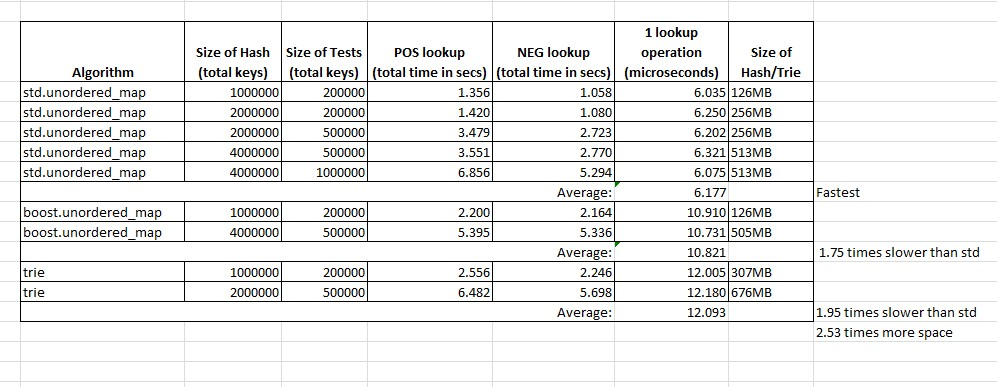

## Goal

Compare different C++ libraries for their hash implementation performances. Firstly, lookup times were tested.
Current algorithms tested:

 * std::unorederd_map
 * boost::unoredered_map
 * trie  - a radix tree implementation. modified from [here](https://github.com/kephir4eg/trie)
 
 ## Dependencies
 
 Install and build boost v1.65 for Windows by following [these instructions](http://www.boost.org/doc/libs/1_65_0/more/getting_started/windows.html#build-from-the-visual-studio-ide).
 
 ## Results
 
 As discussed in chat `std::unorderedmap` seems to be the best option:
 
 
 

