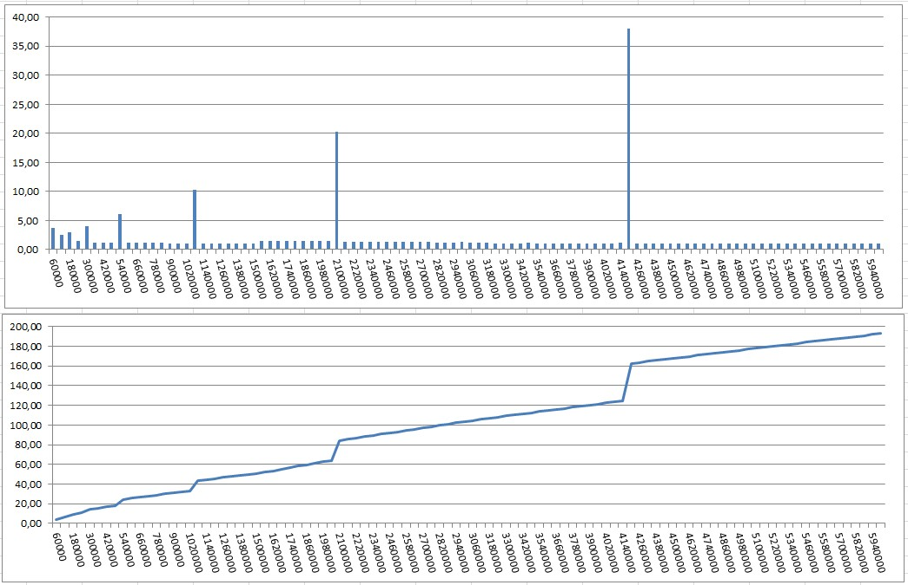
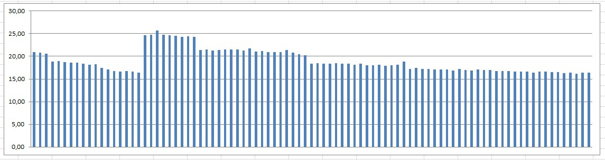

## Goal

Test how insert (new key addition) time changes while we build a large hash. 

## Results

* As expected, the current size of the hash doesn't effect time spent on an insert operation significantly. 
* Each insert operation takes 15-23 microseconds with `std::unordered_map`.  
* I measure insert time in batches. When the hash needs to be expanded because of reaching full capacity, 
the total time for that batch becomes larger than other batches. Since generally hash capacity is doubled in such situations 
each expansion and required rehashing takes longer time than the previous case. For 6 million keys the last 3 expansions took
approximately 9, 19 and 36 seconds when hash length hit 1M, 2.1M and 4.2M keys respectively. 
* Even with spending time on these expansions a 4 million hash with key lengths 6-20 takes 115 seconds to become full. 
A 6 million hash with key lengths 6-20 takes 192 seconds.

## Charts

First chart shows in seconds how much each bucket (60000 keys) took for 6M size hash. Second chart shows cumulative time. 
The last chart shows that if we remove the buckets which spike because of expansion, average lookup time is between 15-25 microseconds per insert operation (the smallest buckets in chart 2). The values used in these charts can be found in the [output file](keys_6M_L6-25.txt_times.txt) given in this repository.

