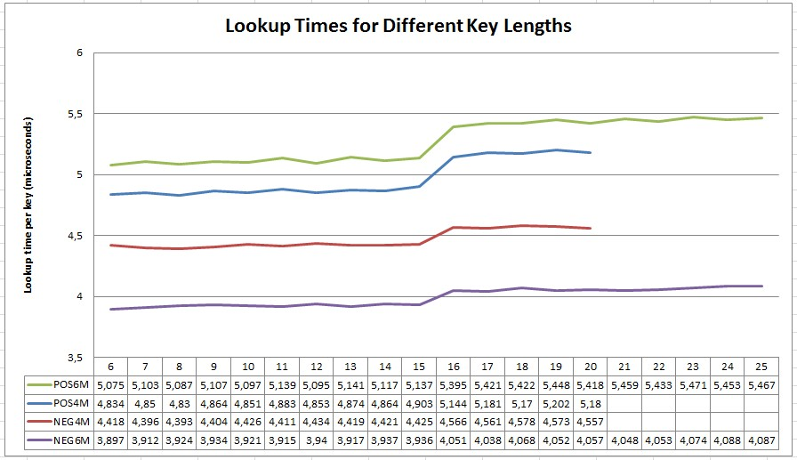

## Goal

To test if key string length effects lookup operations.

## Results

I ran positive and negative test cases on 4 million and 6 millon hash sizes with key lengths 6 to 20. The output results can be found [here](results.txt).

The chart also shows that key length doesn't effect performance (lookup times in microseconds).

